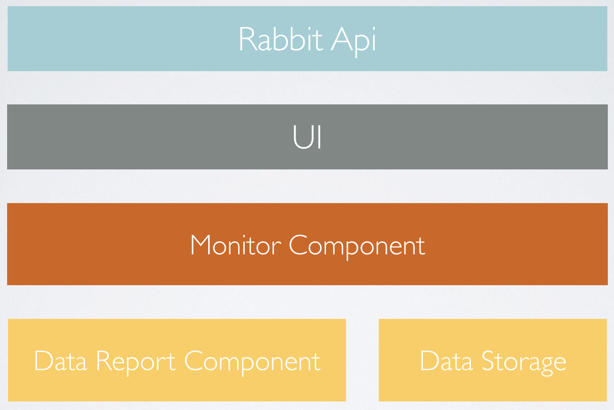

# Rabbit

**Rabbit目标是成为一个全面、简单易用的`APM`系统。**

# 客户端功能

目前主要包括下面功能:

1. 网络日志监控
2. App Crash 捕获
3. App 流畅度(FPS) 监控
4. App 卡顿监控
5. App 测速 (应用启动测速&页面测速)
6. 网络请求耗时监控
7. 内存泄漏检测(LeakCanary)
8. apk内容分析与优化
9. 应用内存分析

# 引入

>根目录`build.gradle`
```
dependencies {
    classpath 'com.susion:rabbit-gradle-transform:0.0.3'
}
```

>应用build.gradle
```
apply plugin: 'rabbit-tracer-transform' //引入插件

dependencies {
    debugImplementation "com.susion:rabbit:0.0.5"  
    releaseImplementation "com.susion:rabbit-noop:0.0.5" // release 下不做任何操作
} 
```

>对于`rabbit-tracer-transform`, 可以采用下面的方式是之只在`debug`下生效:
```
def taskName = getGradle().getStartParameter().taskNames.toString().toLowerCase()
if (taskName.contains("debug")){
    print("apply rabbit transform ! ---->")
    apply plugin: 'rabbit-tracer-transform'
}
```

## 引入配置

```
Rabbit.config(config)
```

>相关支持配置见: [RabbitConfig](https://github.com/SusionSuc/Rabbit/blob/master/rabbit/src/main/java/com/susion/rabbit/RabbitConfig.kt)


# 架构

>整个代码项目代码结构如下图:




**由于目前处于开发阶段,各个功能都在不断完善中,有任何意见欢迎提`issue`或者`mr`,也欢迎你加入到`rabbit`的开发中。**

>实现原理相关文章见:[Rabbit实现原理剖析](https://github.com/SusionSuc/AdvancedAndroid/blob/master/Rabbit%E5%AE%9E%E7%8E%B0%E5%8E%9F%E7%90%86%E5%89%96%E6%9E%90/README.md)
