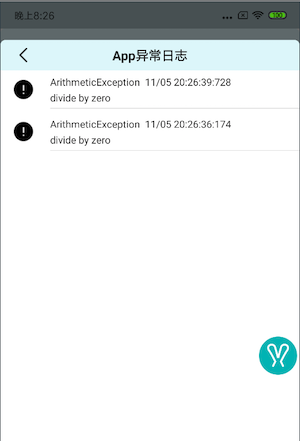

# Rabbit [Developing]

**Rabbit是一个可以帮助Android开发者提高开发效率和App质量的开发者工具，它的定位在一定程度上更偏向于`APM`。Rabbit目前处于开发阶段,各个功能都在不断完善中,如果哪里不足欢迎提`issue`或者`mr`**

>**本项目的初衷是使自己了解性能监控等模块的实现原理, 因此对于每一个功能我都会比较详细的记录其实现原理**

实现原理相关文章见:[Rabbit实现原理剖析](https://github.com/SusionSuc/AdvancedAndroid/blob/master/Rabbit%E5%AE%9E%E7%8E%B0%E5%8E%9F%E7%90%86%E5%89%96%E6%9E%90/README.md)

目前主要包括下面功能:

1. 网络日志监控
2. App Crash 捕获
3. App 流畅度(FPS) 监控
4. App 卡顿监控
5. App 测速 (应用启动测速&页面测速)

# 使用文档

**Rabbit目前并没有提供快捷引入其他App的方法,如果你想了解Rabbit的使用的话可以Clone工程，查看Demo中的用法。**

>由于目前处于开发中，`Rabbit`的代码结构变动可能会比较频繁，我目前也是看到不满意的地方就会重构一下~

## 初始化

>在`Application`中添加:
```
val rabbitConfig = RabbitConfig()

...设置支持的config选项

Rabbit.init(this,rabbitConfig)
```

## 网络日志监控

目前`Rabbit`只支持监控`OkHttp`的网络日志，可以在`OkHttpClient`构建时添加下面代码来开启**网络日志监控功能**:

```
val okHttpClient = OkHttpClient.Builder().addInterceptor(Rabbit.getHttpLogInterceptor())
```

添加后可以在`Rabbit`中查看网络日志:


## 异常日志捕获

`Rabbit`默认使用`Theread.setDefaultUncaughtExceptionHandler`来捕获线程crash并保存到数据库中:



## App 流畅度(FPS) 监控  && App 卡顿监控

可以在Rabbit功能配置页打开这两个功能。当监控到卡顿时会保存到数据库，可以在Rabbit中查看页面卡顿原因。

可以调用下面方法打开/关闭这两个功能:

```
    RabbitTracer.openFpsMonitor()
    RabbitTracer.closeFpsMonitor()

    RabbitTracer.openBlockMonitor()
    RabbitTracer.closeBlockMonitor()
```


## App测速

目前App测速功能主要包括:

1. `Application.onCreate`耗时统计
2. 应用冷启动耗时统计
3. `Activity.onCreate`耗时统计
4. `Activity`首次`inflate`耗时统计
5. `Activity`首次渲染耗时

具体实现原理可以看[测速组件实现原理](https://github.com/SusionSuc/AdvancedAndroid/blob/master/Rabbit%E5%AE%9E%E7%8E%B0%E5%8E%9F%E7%90%86%E5%89%96%E6%9E%90/%E5%BA%94%E7%94%A8%E6%B5%8B%E9%80%9F%E7%BB%84%E4%BB%B6.md),最终呈现效果如下图:

>应用启动耗时统计


>页面启动耗时统计


# 实现原理

>Rabbit相关实现原理剖析，欢迎关注我的微信公众号:

- [掘金](https://juejin.im/user/57b1173f165abd0054298059)


