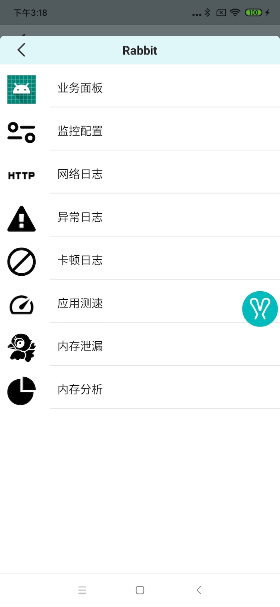
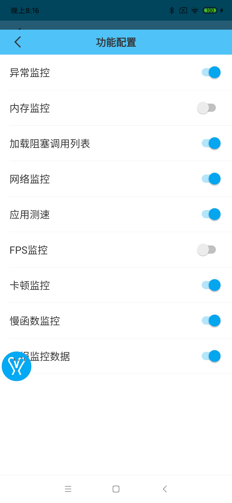

# Rabbit使用文档

## 文档索引

- [应用测速](./speed-monitor.md)
- [网络日志监控](./net-log-monitor.md)
- [卡顿日志监控](./block-log-monitor.md)
- [FPS和内存监控](./memory-fps-monitor.md)
- [异常与内存泄漏捕获](./others-monitor.md)
- [数据上报](./data-report.md)

## 引入方法

>根目录`build.gradle`
```
dependencies {
    classpath 'com.susion:rabbit-gradle-transform:0.0.3'
}
```

>应用build.gradle
```
apply plugin: 'rabbit-tracer-transform' //引入插件

dependencies {
    debugImplementation "com.susion:rabbit:0.0.7.1"  
    releaseImplementation "com.susion:rabbit-noop:0.0.7.1" // release 下不做任何操作
} 
```

### 引入示例

>下面是一个引入`rabbit`的思路


1. 新建`rabbit-plugin.gradle`:

```
def taskName = getGradle().getStartParameter().taskNames.toString().toLowerCase()
def inDebug = taskName.contains("debug")
def rabbitVersion = "0.0.7.1"
def rabbitDepen = "com.susion:rabbit-noop:$rabbitVersion"

if(inDebug){
    print("apply rabbit transform ! ---->")
    apply plugin: 'rabbit-tracer-transform'

    rabbitConfig {
        monitorPkgNamePrefixList = ['com.susion.rabbit.demo']
    }

    rabbitDepen = "com.susion:rabbit:$rabbitVersion"
}

rootProject.ext {
    rabbitDependence = rabbitDepen
}
```

2. 主项目`build.gradle`文件

```
apply from: 'rabbit-plugin.gradle'
```

### 配置

```
Rabbit.config(config)
```

相关支持配置见:[RabbitConfig](https://github.com/SusionSuc/Rabbit/blob/master/rabbit/src/main/java/com/susion/rabbit/RabbitConfig.kt),各项配置具体含义会在每个功能的文档中做详细的介绍。

## 基本使用

`rabbit`依赖于悬浮窗权限来展示各种监控数据，可以调用下面方法来打开`rabbit`:

>Rabbit.kt
```
fun open(requestPermission: Boolean = true, activity: Activity)
```

即`Rabbit.open(true, this)`, 这个方法会主动申请悬浮窗权限。如果有权限的话会打开`rabbit`浮标:


点击`rabbit`浮标即可进入`rabbit`面板:



这样可以看到`rabbit`各项功能的入口。 

**可以通过再次点击`rabbit`浮标来关闭`rabbit`浮窗。**

## 监控功能开关配置

### 通过代码配置

可能通过配置来决定`rabbit`打开哪些监控:

```
val autoOpenMonitors = hashSetOf(RabbitMonitorProtocol.NET.name, RabbitMonitorProtocol.EXCEPTION.name)

rabbitConfig.monitorConfig.autoOpenMonitors.addAll(autoOpenMonitors)

Rabbit.config(rabbitConfig)
```
>上面配置会自动打开**网络日志监控**和**异常日志监控**功能

### UI配置

当然也可以在UI浮窗中配置各项功能打开与否。点击**监控配置**即可看到具体功能配置页面:




