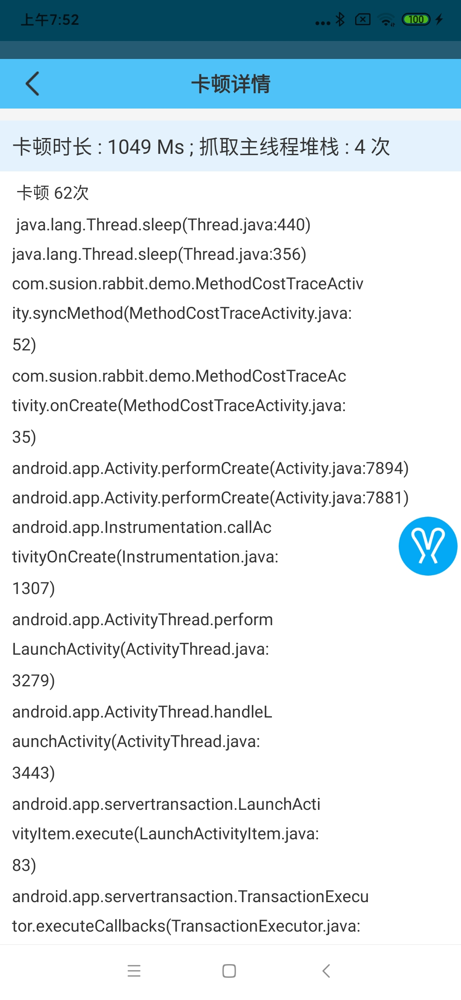

# 卡顿监控

## 自定义卡顿监控阈值

`rabbit`支持自定义卡顿监控阈值:

```
val rabbitConfig = RabbitConfig()
rabbitConfig.monitorConfig.blockThresholdNs = TimeUnit.NANOSECONDS.convert(1, TimeUnit.SECONDS)
```
>设置后, 卡顿时间超过一秒就会触发卡顿捕获

## 自定义卡顿时栈采集周期

>`rabbit`为了拿到卡顿时的堆栈会周期性的异步采集主线程堆栈，对于这个采集周期可以自定义:

```
val rabbitConfig = RabbitConfig()
rabbitConfig.monitorConfig.blockStackCollectPeriodNs = TimeUnit.NANOSECONDS.convert(10, TimeUnit.MILLISECONDS)
```
>设置后, 每`10ms`就会采集一次主线程的堆栈

下面这个代码的采集结果为:

```
    Thread.sleep(2000)
```



