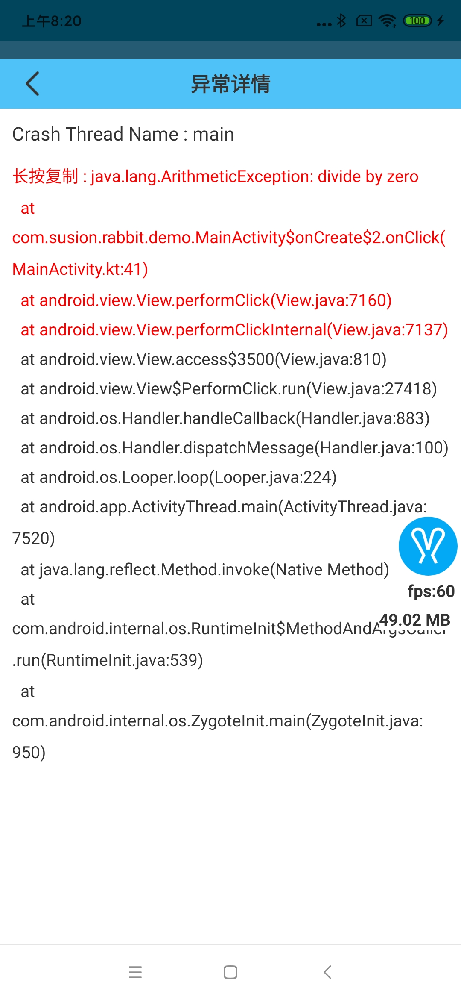

# 异常捕获与内存泄漏

## 异常捕获

`rabbit`目前只支持捕获`java层`异常,主要实现原理如下:

```
Thread.setDefaultUncaughtExceptionHandler { thread, throwable ->
    saveCrash(throwable, thread, defaultExceptionHandler)
}
```

捕获到异常后可以在控制面板中看到异常原因:



## 内存泄漏捕获

`rabbit`目前通过`leakcanary`来捕获应用的内存泄漏,该功能只能在`debug`中生效。

>`rabbit`使用的`leakcanary`版本为: `2.0-beta-5`

不要忘记引入leakcanary:

```
dependencies {
    debugImplementation "com.squareup.leakcanary:leakcanary-android:$2.0-beta-5" //如果使用leakcanary的话，需要引入leakcanary
} 
```


