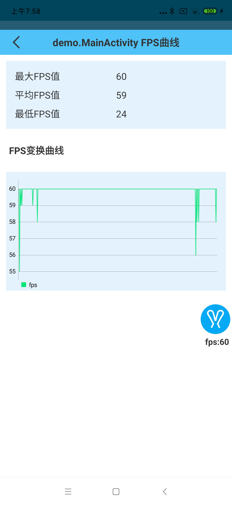
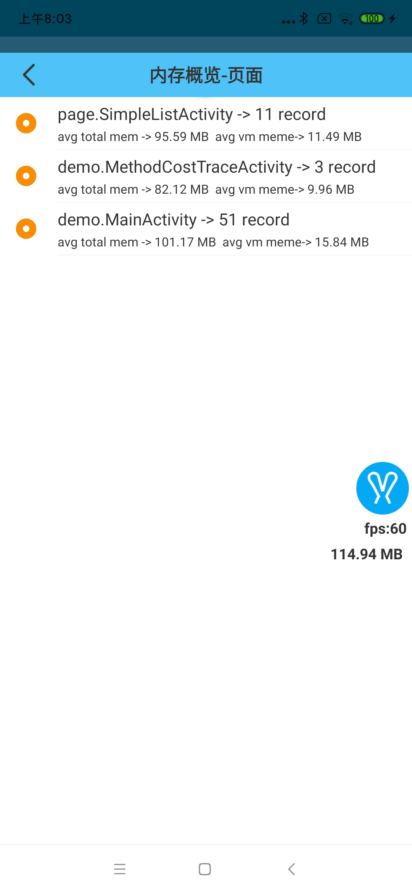

# FPS与内存监控

## FPS监控

`rabbit`只会在应用主循环运行时监控应用的`FPS`,并可以自定义`FPS`的计算周期(即多长时间计算一次平均FPS值):

```
val rabbitConfig = RabbitConfig()
rabbitConfig.monitorConfig.fpsCollectThresholdNs = TimeUnit.NANOSECONDS.convert(10, TimeUnit.MILLISECONDS)
Rabbit.config(rabbitConfig)
```
>配置后，在FPS监控启动情况下，每10ms会计算一次应用的FPS值。

### 查看FPS

当FPS监控打开后，实时的FPS会显示在`rabbit`浮标上:


也可以分页面查看FPS:



## 内存监控

`rabiit`通过`Debug.MemoryInfo()`来获取应用的实时内存情况, 可以通过配置来控制内存采样周期:

```
val rabbitConfig = RabbitConfig()
rabbitConfig.monitorConfig.memoryValueCollectPeriodMs = 2000L
Rabbit.config(rabbitConfig)
```
>配置后，会每2秒采集一次内存值。

### 查看当前内存值

当F内存监控打开后，实时的内存状态会显示在`rabbit`浮标上:


rabbit也会统计出每一个页面的内存使用情况:

