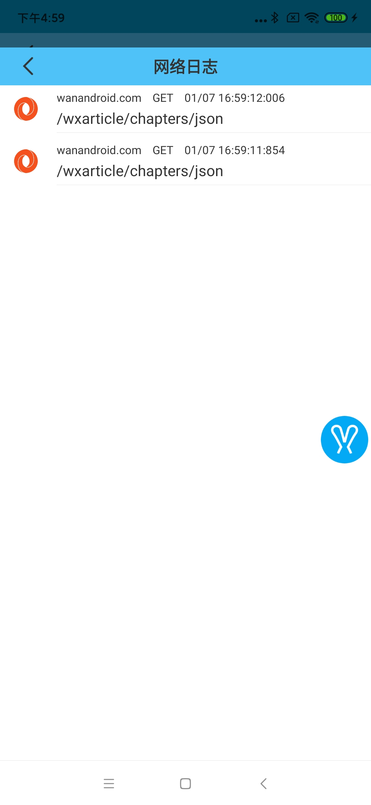
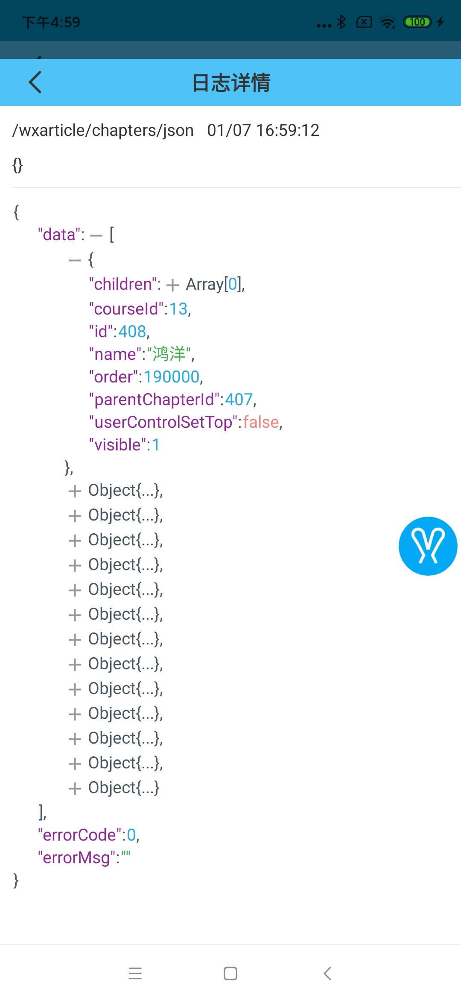

# 网络日志监控

目前只支持`okhttp`框架，需要在初始化`OkHttpClient`时加入自定义的拦截器`Rabbit.getNetInterceptor()`:

```
val okHttpClient = OkHttpClient.Builder()
    .addInterceptor(Rabbit.getNetInterceptor())
    ...
    .build()
```

对于网络日志的监控目前主要包括下面几点:

1. 记录每一个请求的成功与失败
2. 记录每一个请求path、参数
3. 可以方便的查看后台返回的json数据

监控示例:



