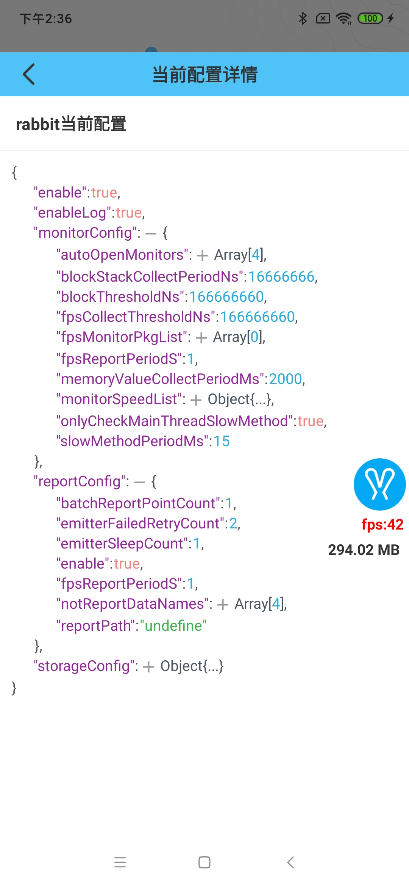

# RabbitConfig

[RabbitConfig](https://github.com/SusionSuc/rabbit-client/blob/master/rabbit-base/src/main/java/com/susion/rabbit/base/config/RabbitConfig.kt)这个类包含了`Rabbit`所有可用配置:

```
class RabbitConfig(
    var enable: Boolean = true,
    var enableLog: Boolean = true,
    @Transient var uiConfig: RabbitUiConfig = RabbitUiConfig(),
    var storageConfig: RabbitStorageConfig = RabbitStorageConfig(),
    var monitorConfig: RabbitMonitorConfig = RabbitMonitorConfig(),
    var reportConfig: RabbitReportConfig = RabbitReportConfig()
)
```

具体指出的配置可以看各个功能文档。

# 插件配置示例

下面包含了`rabbit grale plugin`所支持的所有配置:

>[配置示例](https://github.com/SusionSuc/rabbit-client/blob/master/buildSystem/rabbit-plugin.gradle)

```
 rabbitConfig {
    //是否启动字节码插桩; 状态切换应clean工程
    enable = true

    // 应用测速
    enableSpeedCheck = true

    // 阻塞代码调用
    enableBlockCodeCheck = true

    //方法耗时
    enableMethodCostCheck = true

    // 编译时打印插桩log
    printLog = true

    //应用测速扫描范围
    pageSpeedMonitorPkgs = ['com.susion.rabbit.demo']

    //函数耗时扫描范围
    methodMonitorPkgs = ['com.susion.rabbit.demo', 'com.susion.rabbit.demo.page']

    //阻塞代码扫描范围
    blockCodePkgs = ['com.susion.rabbit.demo']

    //自定义阻塞代码点
    customBlockCodeCheckList = ['com/susion/rabbit/demo/MainActivity.fakeBlockCode()V']
}
```

# 快速查看rabbit当前配置

可以点击rabbit主面板右上角的火箭(🚀)按钮,然后点击**查看当前配置**:



# 监控开关配置

## 通过代码配置

可以通过代码来配置`rabbit`各项监控的打开与否:

```
val autoOpenMonitors = hashSetOf(RabbitMonitorProtocol.NET.name, RabbitMonitorProtocol.EXCEPTION.name)

rabbitConfig.monitorConfig.autoOpenMonitors.addAll(autoOpenMonitors)

Rabbit.config(rabbitConfig)
```
>上面配置会自动打开**网络日志监控**和**异常日志监控**功能

## UI配置

当然也可以在UI浮窗中配置各项功能打开与否。点击**监控配置**即可看到具体功能配置页面:


