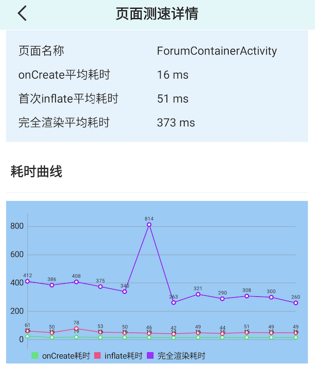
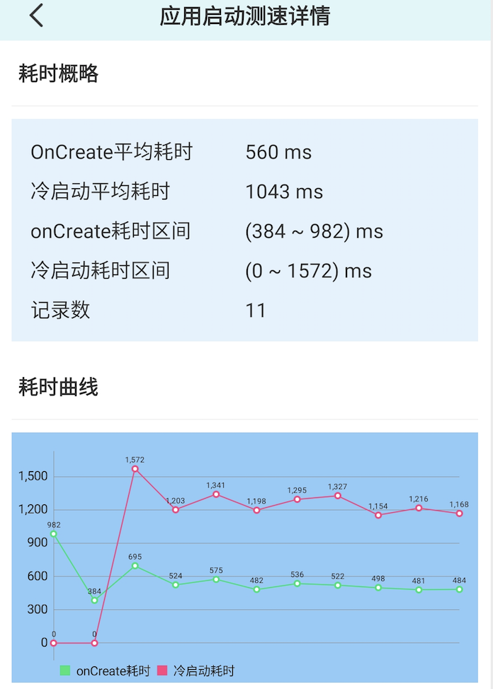
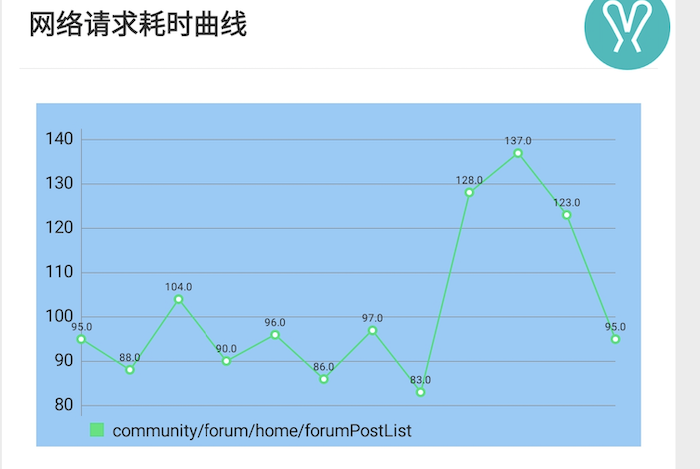

# 应用测速功能

该功能目前主要分为下面几个点:

1. Application创建耗时
2. 页面测速
3. 应用冷启动测速
4. 页面网络请求耗时监控

>为了方便理解每一段耗时统计的含义,可以先尝试理解下图:


## 使用

测速功能主要是通过编译期字节码插桩来完成的，因此需要引入自定义的gradle插件:

>根build.gradle
```
classpath 'com.susion:rabbit-gradle-transform:0.0.3'
```

>应用build.gradle
```
apply plugin: 'rabbit-tracer-transform'
```

### 配置

目前可以通过在`assets`目录下提供`rabbit_speed_monitor.json`文件来配置测速功能, 比如:

```
{
  "home_activity": "MainActivity",
  "page_list": [
    {
      "page": "ForumContainerActivity",
      "api": [
        "api/xxx1",
        "api/xxx2"
      ]
    }
    ...
  ]
}
```

`home_activity`:它指定了应用的入口`Activity`, 主要和应用冷启动逻辑相关联，如果配置的此项，那么冷启动耗时可以测量到上图的中**T6**。

`page_list`: 用来配置每一个测速页面。当配置的`api`中的接口都请求完成后就会触发这个页面的**T6**点。

## 统计示例

最终生成的测速结果如下图:

>页面渲染


>应用冷启动


>网络耗时监控



## 参考文章

[rabbit应用测速实现原理](https://github.com/SusionSuc/AdvancedAndroid/blob/master/Rabbit%E5%AE%9E%E7%8E%B0%E5%8E%9F%E7%90%86%E5%89%96%E6%9E%90/%E5%BA%94%E7%94%A8%E6%B5%8B%E9%80%9F%E7%BB%84%E4%BB%B6.md)

[Android自动化页面测速在美团的实践](https://tech.meituan.com/2018/07/12/autospeed.html)